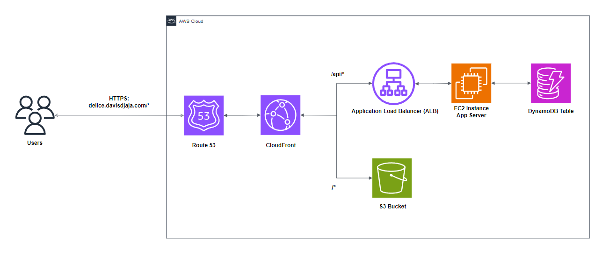
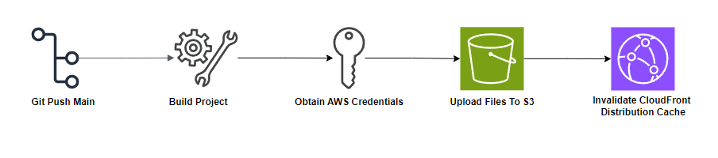

<h1 align="center">Delice</h1>

  

    An online menu & ordering application for cafe Delice. 
     
    <a href="https:delice.davisdjaja.com"><strong>View Demo</strong></a>
     
    
Or Scan the QR code below:

    
     
    <a href="https://github.com/Denz1423/delice-client">Client Repository</a>
    ·
    <a href="https://github.com/Denz1423/delice-api">API Repository</a>
  

## About The Project

A full stack application built with React TypeScript and .NET and hosted using AWS cloud services. 

### Built With

- 

## Architecture

### Request Flow

1. When a user access the application through `delice.davisdjaja.com`, Route 53 resolves the domain to the CloudFront distribution.
2. Requests to `delice.davisdjaja.com/*` are received by the cloudfront distribution and it determines how to route it based on URL patterns.
3. If the URL matches `delice.davisdjaja.com/api/*`.
   1. Forward the request to the application load balancer (ALB).
   2. The ALB routes the request to the appropriate Target Group, which is an EC2 instance running the backend server for the application.
4. For all other URLs that do not match the `delice.davisdjaja.com/api/*` pattern, CloudFront forwards the request to an Amazon S3 bucket containing the react application.

## Deployment Pipelines

### Client

### Server

Work in Progress